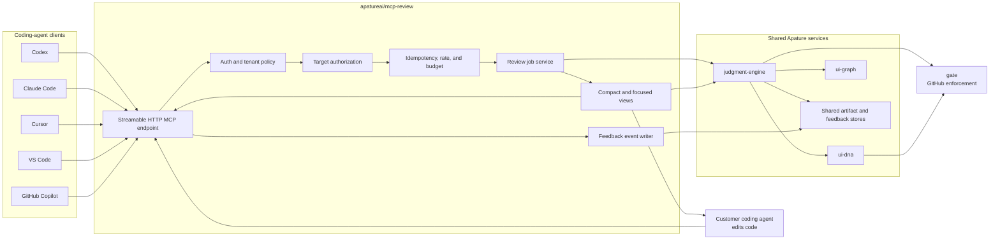
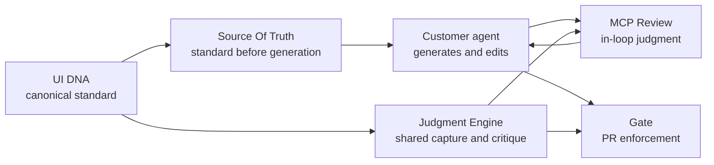
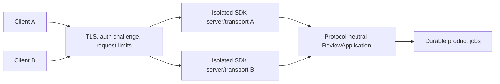
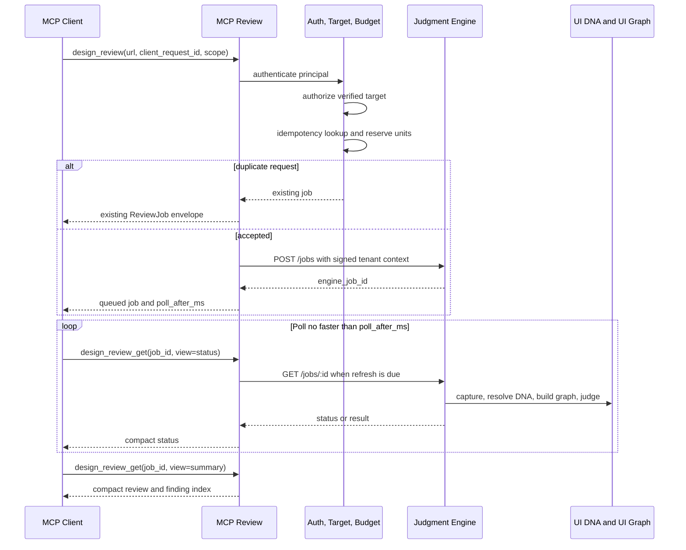
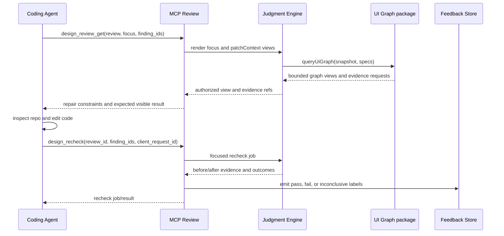
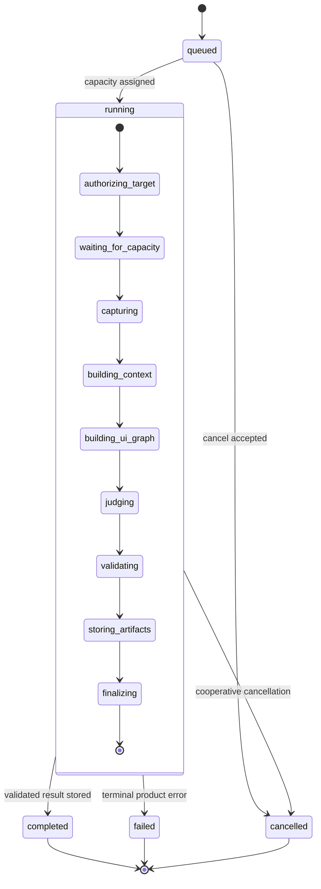
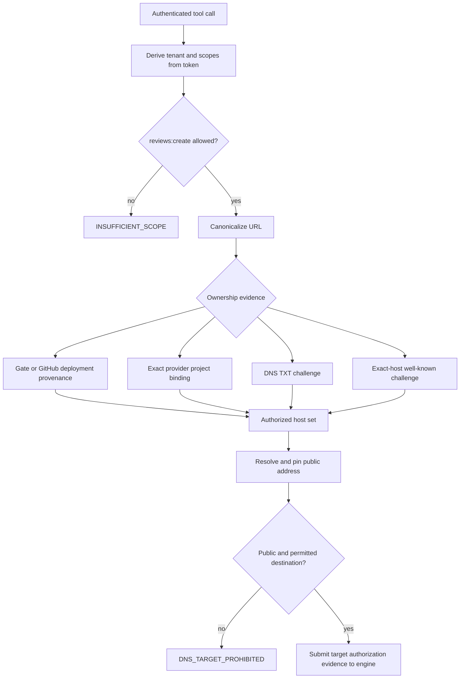
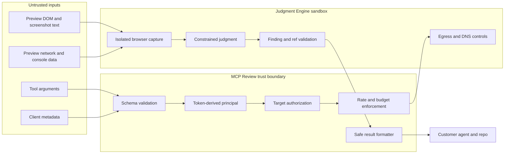
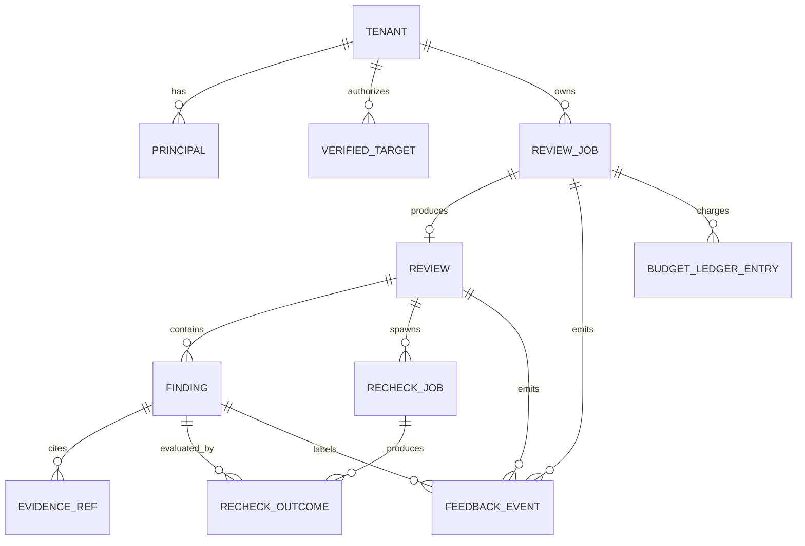
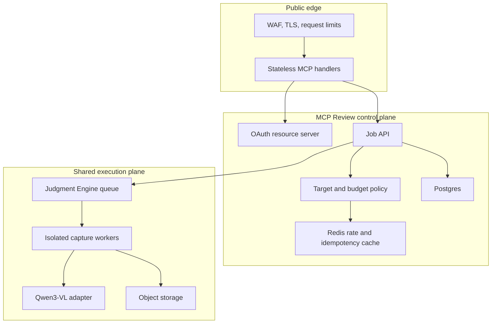

# Apature MCP Review Architecture

Created: 2026-06-18
Revised: 2026-06-19
Status: agent-facing architecture record

## 1. Architecture Summary

MCP Review is an agent-facing control plane around shared Apature judgment services.

It owns:

- MCP protocol adaptation;
- principal and target authorization;
- idempotency;
- usage budgets;
- review-job UX;
- compact/focused result formatting;
- recheck semantics;
- feedback event labeling.

It delegates:

- capture, context extraction, model calls, validation, and artifacts to Judgment Engine;
- canonical design standards to UI DNA;
- rendered-scene representation to UI Graph;
- PR publishing and enforcement to Gate.

## 2. System Boundary

## 3. Product Roles

The boundaries are:

- Source Of Truth says what standard to use.
- The customer's agent writes code.
- MCP Review judges and verifies during creation.
- Gate independently enforces the PR boundary.

### Protocol adapter boundary

Mutable MCP SDK server or transport instances never cross client or tenant boundaries. The adapters may be short-lived or connection-scoped, but durable authorization, idempotency, budget, and review state lives behind `ReviewApplication`.

The final `2025-11-25` adapter owns initialization and any transport session. A future `2026-07-28` adapter owns stateless request metadata, routing-header/body consistency, cache metadata, and extension negotiation without changing the application contract.

## 4. Review Submission Flow

## 5. Focused Repair and Recheck Flow

## 6. Job Lifecycle

Product state is explicit and stored in shared durable storage. An MCP transport session may disappear without affecting the job.

**Runtime binding added July 11, 2026 (#36).** `ReviewApplicationStore` is the transport-neutral persistence port. The production adapter uses tenant-scoped Postgres transactions and RLS; an in-memory adapter exists only for deterministic tests. Every isolated protocol server receives the same application store and an explicitly injected engine adapter. The shipped entrypoint has no mock-engine or empty-target fallback, and readiness is the conjunction of store, Judgment Engine, target-authorization store, and sandboxed DNS health.

## 7. Authentication and Target Authorization

Authentication and domain verification are separate:

- a valid user cannot capture an unverified target;
- a verified target cannot be captured by another tenant;
- a verified hostname cannot resolve to a prohibited network.

## 8. Trust Boundaries

No untrusted page content is allowed to become:

- server instructions;
- tool descriptions;
- an authorization decision;
- a new tool call request;
- a repository write.

## 9. Data Model

Canonical storage ownership:

| Data | Owner |
|---|---|
| MCP auth principal and scoped token metadata | MCP Review / shared identity |
| Verified target records and proof metadata | MCP Review |
| Product job state and budget ledger | MCP Review |
| Raw screenshots, DOM, capture bundle | Judgment Engine |
| Findings and validation lineage | Judgment Engine, projected into MCP Review views |
| UI DNA snapshot | UI DNA |
| UI Graph schema and deterministic builder/renderer | UI Graph |
| UI Graph snapshot storage and authorized view serving | Judgment Engine |
| Shared feedback event substrate | Judgment Engine/shared data layer |
| GitHub publish state | Gate |

## 10. Cross-Repo Contracts

### Judgment Engine

MCP Review sends:

- tenant and repository identity;
- authorized canonical target and proof reference;
- routes/viewports/depth;
- review or recheck intent;
- idempotency key;
- deadline and cancellation;
- requested output contract version.

Judgment Engine returns:

- job state;
- review result;
- capture and model lineage;
- validated findings;
- artifact refs;
- usage measurements;
- typed engine error.

### UI DNA

MCP Review never directly edits or approves DNA. It receives version and provenance through engine results.

### UI Graph

MCP Review requests named views from Judgment Engine by review and finding IDs. Judgment Engine maps them to UI Graph `summary`, `violations`, `focus`, and `patchContext` specs. MCP Review never calls UI Graph directly and does not define graph construction.

### Gate

MCP Review may link a review to a repository, PR, and SHA for analytics, but it never publishes comments or Check Runs. Gate can later correlate MCP fix-loop outcomes with CI results.

### Source Of Truth

Tool names and responses remain distinct. MCP Review may cite the same DNA version, but it does not expose Source Of Truth's component lookup tools.

### Pointer

Pointer owns localhost, live browser attachment, overlay state, and pointing. MCP Review does not start or manage live sessions.

## 11. Deployment Shape

The MCP handler tier should be horizontally scalable. Any required final-spec transport session support is isolated from product jobs and must not require sticky product routing. Each handler uses a patched stable SDK and isolates mutable server/transport instances by client connection or request.

## 12. Failure Modes

| Failure | Required behavior | Retry |
|---|---|---|
| Missing/invalid auth | Return transport/auth challenge | After auth |
| OAuth client registration method unsupported | Fall back through pre-registration, Client ID Metadata Documents, then Dynamic Client Registration | After compatible registration |
| Insufficient scope | Structured scope error | Only after scope grant |
| Unverified domain | Explain verification method | No automatic retry |
| Shared provider wildcard requested | Reject; require exact project/host proof | No |
| DNS resolves to prohibited address | Reject and security-log | No |
| Redirect leaves authorized host set | Reject | No |
| Duplicate request ID, same arguments | Return original job | Not needed |
| Duplicate request ID, changed arguments | `IDEMPOTENCY_CONFLICT` | New request ID |
| Tenant/repo budget exhausted | Return reset time and reduce-scope hint | After reset/admin change |
| Concurrency full | Queue or return bounded delay per policy | With jitter |
| Client disconnects after submit | Job continues; recover by request/job ID | Poll |
| MCP transport session expires | Reconnect; job remains available | Yes |
| SDK server/transport instance would be shared across clients | Reject unsafe construction in tests/deployment; isolate instances | Operator action |
| Engine 409 duplicate | Poll existing engine job | No duplicate work |
| Engine 429/503 | Internal capped retry honoring `Retry-After` | Yes, bounded |
| Capture auth wall | `PREVIEW_AUTH_REQUIRED` | After configuration |
| Preview not ready | `PREVIEW_NOT_READY` with evidence | Bounded |
| Capture unstable | Complete with caveat or fail per confidence policy | Usually no |
| UI DNA missing | Continue with explicit degraded grounding if policy allows | No |
| UI Graph missing | Return full finding evidence without focus view | No |
| Model output invalid | Engine validation retry; never publish raw output | Internal bounded |
| Result exceeds client limit | Compact response and paginate | Retrieve smaller view |
| Evidence expired | Return tombstone and retention metadata | New review if needed |
| Recheck target unchanged | Reject without inference | After actual change |
| Finding ID belongs to another review | Reject and security-log | No |
| Host changed during recheck | Require new review | New review |
| Cancellation arrives during inference | Mark cancelled; ignore late result | No |
| Feedback event duplicated | Dedupe on event key | Idempotent |
| Page prompt injection | Treat as untrusted evidence; schema-only output | No |
| Tool metadata unexpectedly changes | Block deployment or alert on manifest hash | Operator action |

## 13. Architecture Invariants

These survive transport, SDK, hosting, and model changes:

1. No customer code or application writes.
2. No GitHub publishing.
3. Gate remains the enforcement and primary revenue surface.
4. Tenant identity comes from credentials, never tool arguments.
5. Target ownership and safe network destination are both required.
6. Review jobs are explicit, durable, and independent of MCP sessions.
7. Submitted work is idempotent.
8. Results are structured, validated, and compact by default.
9. Page content is untrusted data.
10. Recheck labels require changed-target evidence.
11. Cross-repo version lineage is preserved.
12. Optional MCP capabilities are progressive enhancements, not dependencies.
13. Mutable protocol-adapter state never crosses client or tenant boundaries.
