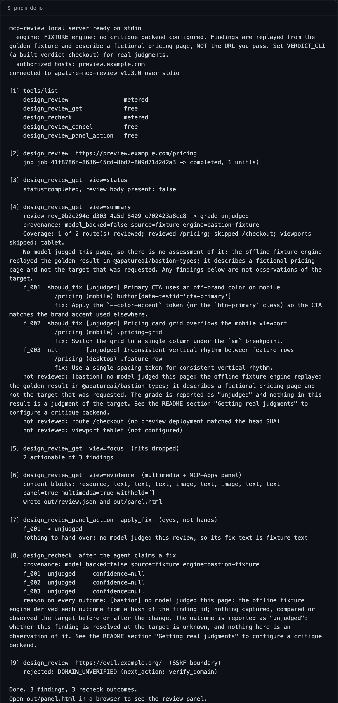

<div align="center">

<picture>
  <source media="(prefers-color-scheme: dark)" srcset="docs/assets/banner-dark.svg">
  
</picture>

<p>in-loop design review over MCP</p>

<p>
  <a href="https://www.npmjs.com/package/@apatureai/bastion"></a>
  <a href="https://github.com/apatureai/bastion/actions/workflows/ci.yml"></a>
  <a href="LICENSE"></a>
</p>

<p>Part of the <a href="https://github.com/apatureai">Apature stack</a> — automated design review for rendered UI. The <a href="https://github.com/apatureai/.github/blob/main/profile/README.md">org profile</a> maps how the pieces compose.</p>

</div>



An MCP server that gives a coding agent eyes on the UI it just changed: submit a preview URL, get findings with route, viewport, element ref and a suggested fix, apply them yourself, then ask the server to recheck. It judges and verifies; it never edits code, drives a browser, or opens a pull request — the server is the eyes, the agent is the hands. Everything runs offline with no credentials, and with nothing configured the judgments come from a golden fixture that says so in every payload; one clone and one environment variable swap in a real critique of a real page.

## Quickstart

Node 24+ and pnpm 9.15.0 (`corepack enable` installs pnpm from the `packageManager` field). No API key, no database, no Docker; `pnpm install` needs the npm registry once, and after that nothing here opens a connection.

```bash
git clone https://github.com/apatureai/bastion.git
cd bastion
corepack enable
pnpm install --frozen-lockfile
pnpm build
pnpm demo
```

`pnpm demo` is a real MCP client. It spawns the server as a child process over stdio, completes a handshake, submits a review, reads it back four ways, acts on a finding, rechecks it, and is denied on an unauthorized host — the nine steps shown in the hero above. It ends:

```console
[9] design_review  https://evil.example.org/  (SSRF boundary)
    rejected: DOMAIN_UNVERIFIED (next_action: verify_domain)

Done. 3 findings, 3 recheck outcomes.
Open out/panel.html in a browser to see the review panel.
```

**Success looks like** nine numbered steps, `3 findings, 3 recheck outcomes`, and two new files: `out/review.json` (the agent-facing `Critique`) and `out/panel.html` (the self-contained review panel).

```bash
open out/panel.html      # macOS; use xdg-open on Linux
```

> The server still identifies itself on the wire as `apature-mcp-review`. That name is part of the MCP handshake and any client configuration that already references it, so the repository rename to `bastion` deliberately left it alone.

If `pnpm demo` reports `Cannot find module`, `pnpm build` has not been run. If step 2 comes back `DNS_TARGET_PROHIBITED` instead of a job, something changed `LOCAL_RESOLVED_ADDRESS` in `packages/mcp-server/src/local-server.ts` to a non-public address, and that rejection is the SSRF guard working.

## What you get

`pnpm demo` reviews `https://preview.example.com/pricing` and writes two files. `out/review.json` is the `Critique` a coding agent reads: a `grade`, a `findings[]` array where each entry carries a `dimension`, `severity`, `route`, `viewport`, `element_ref` and a `suggestion` fix string, plus two envelopes an agent must check before trusting any of that — `provenance` and `coverage`. `out/panel.html` is the same review as a self-contained HTML panel: no scripts, no external requests, evidence embedded as `data:` URIs. The `job_*` and `rev_*` ids are freshly generated, so yours differ from the hero's.

With nothing configured the findings are a golden fixture describing a fictional pricing page, not a judgment of the URL you passed — and the payload says so rather than relying on the startup banner, because the consumer is usually an agent that never sees the banner. [The full result contract](docs/result-contract.md) covers grounding, the model-free `measurements` block, and how every payload an agent reads — the recheck, the panel action, each finding, each content block — carries the same marker.

### Provenance: did anything judge this page?

Every `Critique` carries a `provenance` object, on every backend including the offline fixture path, so an agent that never sees the terminal can answer "which engine ran" from the payload alone:

```json
"grade": "unjudged",
"confidence": null,
"provenance": { "model_backed": false, "source": "fixture", "engine": "bastion-fixture", "model": null }
```

The rule an agent codes against: **trust the result only when `provenance.model_backed === true` and `coverage.state` is not `"nothing"`.** When `model_backed` is `false` — the fixture engine, or verdict run with `--model mock`/`--model canned` — the grade is the literal `"unjudged"`, `confidence` is `null`, the narrative says no model judged the page instead of describing one, and every finding carries `"unjudged": true`. When it is `true`, the engine's grade, narrative and findings pass through untouched and `provenance.model` names the judge. A remote verdict deployment reports `null`: a real judgment may be behind it, but this process cannot see how that deployment is configured and does not claim to.

### Coverage: what did it actually look at?

`provenance` answers whether a model judged the page; it does not answer what the model judged, and those come apart. Verdict's triage can conclude a deep review is needed and then name no route to run it on: a model really was called (`model_backed` truthfully `true`), yet no page was judged, and a result with no surviving findings grades `ship` by construction. So every `Critique` also carries `coverage`:

```json
"grade": "nothing_reviewed",
"coverage": { "state": "nothing", "routes_requested": ["/", "/pricing"], "routes_reviewed": [], "routes_skipped": ["/", "/pricing"] }
```

`state` is `full` (nothing suppressed), `partial` (a real verdict about a smaller surface; `routes_skipped` names what it missed), `nothing` (the grade becomes `"nothing_reviewed"` and every finding is marked `unjudged`), or `unstated` (the engine reported no coverage — never read as "everything was reviewed"). `nothing_reviewed` wins over `unjudged` when both apply, and both facts stay in the payload. This is the same rule and vocabulary [apatureai/gate](https://github.com/apatureai/gate) uses for its Check Run, so the two surfaces cannot tell different stories about one run.

## Usage

| Tool | Metered | What it does |
|---|---|---|
| `design_review` | yes | Submit an async review of an authorized HTTPS preview (routes, viewports, `triage`/`deep` depth). Returns a job. |
| `design_review_get` | no | Poll job status or read the result in one of five views. |
| `design_recheck` | yes | Re-judge 1 to 20 findings from a completed review after the agent changed the UI. Rejects a host change or an unchanged target. Runs against the fixture engine only, where every outcome comes back `"unjudged"`; see [what is not wired yet](docs/configuration.md#what-is-not-wired-yet). |
| `design_review_cancel` | no | Best-effort cancel of a queued or running job; requires the `reviews:cancel` scope. |
| `design_review_panel_action` | no | Route a review-panel interaction: return a grounded finding's fix for the agent, or the refs to re-verify. Returns `unjudged`, and no fix, when nothing judged the review. |

MCP annotations are set from the truth: only `design_review_get` and `design_review_panel_action` carry `readOnlyHint: true`, because submit and recheck create metered jobs and cancel terminates one.

### `design_review_get` views

| `view` | Returns |
|---|---|
| `status` | The job envelope only. No result body, so it stays cheap while a job is still running. |
| `summary` (default) | Job plus the full `Critique`, including its `provenance`. |
| `findings` | Same body as `summary`; the `Critique` already carries every finding inline. |
| `focus` | Job plus the `Critique` narrowed to actionable findings: `blocker` and `should_fix`, with nits dropped. |
| `evidence` | Job, `Critique`, MCP content blocks (panel, text, images), and a `presentation` object naming what the host could not render. |

### The eyes-not-hands boundary, in code

`design_review_panel_action` is where the product boundary is easiest to violate and easiest to test. When a reviewer clicks "apply fix" on a finding, the server reads the completed `Critique`, projects it into fix items (`reviewFixItemsFromCritique`) where a finding is **grounded** only if it is localizable (`element_ref`) *and* carries a concrete repair constraint (`suggestion`), and runs a pure reducer (`handlePanelAction`):

- a grounded finding comes back `{ "type": "fix", "fix": "..." }`, and that fix is *for the host to hand to the coding agent*;
- an advisory finding comes back `{ "type": "human_only" }`, never an auto-fix;
- a finding from a review nothing judged comes back `{ "type": "unjudged" }` with no fix string at all, because on that path the instruction is fixture text and handing fixture text to a coding agent is precisely the failure this boundary exists to prevent.

"Resolved" is a recheck verdict the service earns, not a status the panel can set.

### Connect your own MCP client

The local server speaks MCP over stdio — what Claude Code, Cursor, Codex, and VS Code use for a local server. `pnpm demo` spawns exactly this command and completes a real handshake against it:

```json
{
  "mcpServers": {
    "apature-review-local": {
      "command": "node",
      "args": ["/absolute/path/to/bastion/packages/mcp-server/dist/local-stdio.js"]
    }
  }
}
```

The only host the local server authorizes is `preview.example.com`; every other host is rejected as `DOMAIN_UNVERIFIED`. Add your own hosts and a critique backend through the environment, with no code change and no rebuild:

```json
{
  "mcpServers": {
    "apature-review": {
      "command": "node",
      "args": ["/absolute/path/to/bastion/packages/mcp-server/dist/local-stdio.js"],
      "env": {
        "BASTION_ALLOWED_HOSTS": "preview.mycompany.com",
        "VERDICT_CLI": "/absolute/path/to/verdict",
        "MODEL_BASE_URL": "https://your-openai-compatible-endpoint/v1",
        "MODEL_API_KEY": "..."
      }
    }
  }
}
```

## Getting real judgments

With nothing configured the findings are a fixture about a fictional pricing page. This replaces them with a real critique of a real page — no credentials from this project, no database, no hosted service. The backend is [apatureai/verdict](https://github.com/apatureai/verdict), public and MIT: it launches headless Chromium, captures each route at each viewport, measures the DOM, critiques the render against your repository's own design system, deletes every finding it cannot point at, and writes the `EngineReviewResult` that `packages/mcp-types/src/engine.ts` declares and this server consumes. Connecting them is configuration, not code.

### 1. Build verdict

```bash
git clone https://github.com/apatureai/verdict.git
cd verdict && corepack enable && pnpm install --frozen-lockfile && pnpm build
pnpm browser:install     # Chromium for playwright-core, roughly 275 MB downloaded
```

### 2. Point bastion at it

```bash
export VERDICT_CLI=/absolute/path/to/verdict
export MODEL_BASE_URL=https://your-openai-compatible-endpoint/v1
export MODEL_API_KEY=<your-key>
```

`VERDICT_CLI` selects the backend; `MODEL_BASE_URL` and `MODEL_API_KEY` are verdict's own variables, passed straight through, so any OpenAI-compatible chat-completions endpoint that accepts images works. Neither half is optional: a key with no base URL, or an explicit `VERDICT_MODEL=live` with no key, is a startup error rather than a silent fallback to the mock — verdict would otherwise answer a live request with its mock client and report `model_backed: true` anyway.

### 3. Review a URL

```bash
pnpm review https://preview.mycompany.com/pricing --routes /pricing --viewports desktop
```

`pnpm review` is the same MCP client `pnpm demo` uses, pointed at a target you name on the command line (which authorizes that host for the run, and says so before it starts). With a key set, verdict runs `--model live` and a model looks at your screenshots; without one it runs `--model canned`, which captures and measures your page for real but judges nothing, and announces that loudly. The per-run artifact directory under `out/verdict/` keeps the screenshots, the DOM geometry map, the measured facts, and the resolved system prompt, so a finding can be checked against what the model was actually shown.

The SSRF boundary makes one narrow exception: a loopback host you name **explicitly** (`localhost`, `127.0.0.0/8`, `::1`) is your own dev server, so it may be plain `http`. The exception is keyed on the literal host, never on where a name resolves, so a public name pointed at loopback is still refused before verdict is even started — DNS-rebind protection:

```console
$ pnpm review https://localtest.me/

rejected: DNS_TARGET_PROHIBITED
  host localtest.me resolves to a prohibited (loopback) address
```

A rejected target is the boundary working, not a crash: `pnpm review` prints the code and reason and exits `1` (it exits `2` only on a usage or engine-configuration error, and `0` on a completed review), so an agent loop can tell a refused target apart from a bug.

### What each mode gives you

| | fixture (default) | verdict CLI, no key | verdict CLI, live model |
|---|---|---|---|
| Configuration | none | `VERDICT_CLI` | `VERDICT_CLI` + `MODEL_BASE_URL` + `MODEL_API_KEY` |
| Screenshots of your page | no | yes | yes |
| DOM measurements of your page | no | yes | yes |
| Findings about your page | no | no | yes |
| Grade in the payload | `"unjudged"` | `"unjudged"` | the engine's grade |
| `provenance.model_backed` | `false` | `false` | `true` |
| Cost | none | none | your endpoint's per-call price |
| `design_recheck` | yes, but every outcome is `"unjudged"` | no, see below | no, see below |

Every critique-backend variable and the honest list of what is not wired yet — including why `design_recheck` does not work against either verdict backend — are in [docs/configuration.md](docs/configuration.md).

## Configuration

None of the variables below are needed by the local server, the quickstart, or the test suite — they configure the Streamable HTTP edge. `Dockerfile` builds the workspace and runs `packages/mcp-server/dist/boot.js`, the production composition root: Streamable HTTP transport, bearer JWT verification against an issuer's JWKS, a Postgres application plane, and a signed client for the judgment engine. It fails closed with a readable message when configuration is missing, and it has no mock fallback — a server that answers with fixture judgments must be the local one, explicitly. Nobody operates a public instance, so `directory/server.json` declares no `remotes`.

| Variable | Required | Default | Effect |
|---|---|---|---|
| `MCP_RESOURCE_URL` | yes (HTTP mode) | none | This server's public resource id, the expected token `aud` |
| `MCP_AUTHORIZATION_SERVERS` | yes (HTTP mode) | none | Comma-separated issuer URLs published in RFC 9728 discovery |
| `MCP_JWKS_URL` | yes (HTTP mode) | none | Issuer JWKS endpoint used to verify token signatures |
| `MCP_TOKEN_ISSUER` | yes (HTTP mode) | none | Expected token `iss` |
| `DATABASE_URL` | yes (HTTP mode) | none | Postgres for durable jobs and the verified-target registry; migrations run at boot |
| `ENGINE_BASE_URL` | yes (HTTP mode) | none | Judgment engine async job API origin |
| `ENGINE_HMAC_SECRET` | yes (HTTP mode) | none | Shared secret signing service-to-service calls |
| `PORT` | no | `8080` | Listener port |
| `MCP_PATH` | no | `/mcp` | MCP endpoint path |
| `MCP_ALLOWED_HOSTS` | no | host of `MCP_RESOURCE_URL` | Permitted `Host` headers (DNS-rebinding defense) |
| `MCP_MAX_BODY_BYTES` | no | `262144` | Request body ceiling; hard maximum 1 MiB |
| `MCP_BODY_TIMEOUT_MS` | no | `30000` | Body-read timeout |
| `MCP_MAX_IN_FLIGHT_PER_PRINCIPAL` | no | `8` | Concurrent authenticated requests per principal; hard maximum 64 |
| `MCP_TEST_DATABASE_URL` | no | none | Test-only. When set, runs the Postgres migration test instead of skipping it |

The critique-backend variables (`VERDICT_CLI`, `MODEL_BASE_URL`, and the rest) are listed separately in [docs/configuration.md](docs/configuration.md); `ENGINE_BASE_URL` and `ENGINE_HMAC_SECRET` are shared by both surfaces.

## Design notes

- [docs/result-contract.md](docs/result-contract.md) — how grounding, the model-free `measurements` block, and every agent-read payload carry the provenance marker.
- [docs/design-notes.md](docs/design-notes.md) — who this is for, why a design reviewer breaks the thin-MCP-wrapper assumptions, and the two independent version numbers.
- [docs/how-it-works.md](docs/how-it-works.md) — the production request path, what is real versus synthetic offline, and the repository map.
- [docs/configuration.md](docs/configuration.md) — the full critique-backend variable reference and what is not wired yet.
- [docs/roadmap.md](docs/roadmap.md) — what works today and the known gaps, each with its seam.

## Status

The local MCP server, all five tools and five views, target authorization and egress classification, job lifecycle and recheck semantics, the Streamable HTTP edge (OAuth 2.1 auth, per-client isolation) and the Postgres application plane all work today and are covered by the suite. A real critique backend runs over a local verdict checkout (`pnpm review <url>`, see [Getting real judgments](#getting-real-judgments)). The main open gaps are `design_recheck` against a verdict backend, real evidence images in the panel, and moving the recheck index and unit ledger into the store. Full detail and the seam for each is in [docs/roadmap.md](docs/roadmap.md).

## Contributing

[CONTRIBUTING.md](CONTRIBUTING.md) covers setup, the test and lint commands, and the conventions that matter (the eyes-not-hands boundary, the contract-tested tool catalog, golden fixtures); the roadmap items are the best place to start, and it is worth opening an issue first if a change is large.

## Security

Report vulnerabilities privately through GitHub's private vulnerability reporting on the repository's Security tab. [SECURITY.md](SECURITY.md) describes supported versions, what a reporter can expect, and what to check before running this against a network you care about.

## License

MIT — see [LICENSE](LICENSE).
